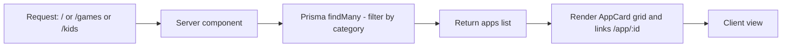
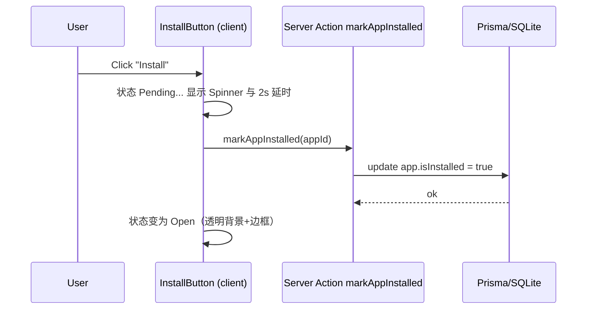

# Play Store Lite - 技术概览

## 项目概述
- **框架**：Next.js 16 (App Router, TypeScript, Webpack)。
- **样式**：Tailwind CSS v4，自定义 M3 主题色、圆角、`shadow-card`。
- **数据**：Prisma + SQLite，使用本地种子数据和本地图片 `/public/icons/*.jpg`。
- **路由**：
  - `/`：全部 Apps。
  - `/games`：Games 分类。
  - `/kids`：Kids 分类。
  - `/app/[id]`：应用详情页（含模拟安装）。

## 主要目录
- `src/app/page.tsx`、`src/app/games/page.tsx`、`src/app/kids/page.tsx`：分类列表页（服务端获取 Prisma 数据）。
- `src/app/app/[id]/page.tsx`：详情页（服务端获取单个 App）。
- `src/components/AppCard.tsx`：应用卡片（可点击跳详情）。
- `src/components/Sidebar.tsx`：侧边导航（Apps/Games/Kids）。
- `src/components/InstallButton.tsx`：客户端安装按钮，含 Server Action。
- `src/app/actions.ts`：Server Action（标记已安装）。
- `src/lib/prisma.ts`：Prisma 客户端单例。
- `prisma/schema.prisma`、`prisma/seed.ts`：数据模型与种子。
- `public/icons/*.jpg`：本地应用图片资源。

## 数据模型
`prisma/schema.prisma`
```prisma
model App {
  id          String  @id @default(uuid())
  title       String  @unique
  developer   String
  iconUrl     String
  description String
  rating      Float
  downloads   String
  category    String
  isInstalled Boolean @default(false)
}
```

## 开发与运行
- 开发：`npm run dev -- --hostname 127.0.0.1 --port 3000`
- 生产构建：`npm run build`
- 种子数据：`npx prisma db seed`（使用本地图片路径，确保 `/public/icons` 存在）
- 数据库：`.env` 中 `DATABASE_URL="file:./dev.db"`

## 数据流（列表页渲染）


## 安装交互时序


## 样式与主题
- Tailwind v4 自定义色：`primary`, `background`, `surface`, `surfaceContainer`, `ink`, `muted`。
- 字体：`Roboto` (400/500/700) 全局。
- 阴影：`shadow-card` = `0 1px 2px 0 rgba(60,64,67,0.3), 0 1px 3px 1px rgba(60,64,67,0.15)`.
- 圆角：使用 `rounded-xl` / `rounded-2xl`。

## 关键交互
- **导航**：Sidebar 链接到 `/`、`/games`、`/kids`，当前项高亮浅绿。
- **卡片**：`AppCard` 支持点击跳转，`Next/Image` 读取本地 `/icons/*.jpg`。
- **详情页**：展示大图标、评分/下载/年龄、描述、Data Safety 卡片。
- **安装按钮**：客户端状态切换 + Server Action 持久化。
