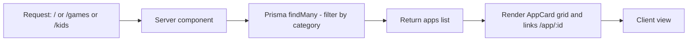
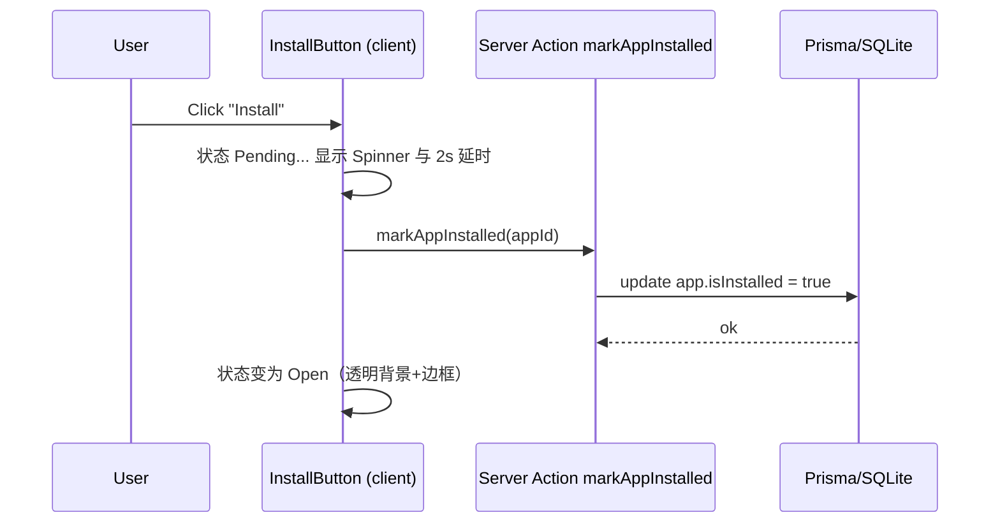

# O Play - 技术概览

## 项目概述
- **框架**：Next.js 16 (App Router, TypeScript, Webpack)。
- **样式**：Tailwind CSS v4，自定义 M3 主题色、圆角、`shadow-card`。
- **数据**：Prisma + SQLite，使用本地种子数据与本地图片 `/public/icons/*`、`/public/placeholders/*`，避免外链失效。
- **路由**：
  - `/`：全部 Apps。
  - `/games`：Games 分类。
  - `/kids`：Kids 分类。
  - `/app/[id]`：应用详情页（含模拟安装、远程安装下发）。
  - `/admin/add`：后台新增应用。

## 主要目录
- `src/app/page.tsx`、`/games/page.tsx`、`/kids/page.tsx`：分类列表页。
- `src/app/app/[id]/page.tsx`：详情页（包含远程安装卡片）。
- `src/components/AppCard.tsx`、`Sidebar.tsx`、`InstallButton.tsx`、`RemoteInstallPanel.tsx`：卡片、导航、模拟安装与远程下发。
- `src/app/api/devices`、`src/app/api/install-requests`：设备注册、远程安装任务接口。
- `src/app/actions.ts`：Server Action（标记已安装）。
- `src/lib/prisma.ts`：Prisma 客户端单例。
- `prisma/schema.prisma`、`prisma/seed.ts`：数据模型与种子（含设备/任务示例）。
- `public/icons/*`、`public/placeholders/*`：本地应用与截图资源。

## 数据模型
`prisma/schema.prisma` 摘要
```prisma
model App {
  id           String @id @default(uuid())
  title        String @unique
  developer    String
  iconUrl      String
  description  String
  rating       Float
  downloads    String
  category     String
  isInstalled  Boolean   @default(false)
  size         String    @default("50 MB")
  version      String    @default("1.0.0")
  updatedAt    DateTime  @default(now())
  releaseDate  DateTime  @default(now())
  reviews      Review[]
  screenshots  Screenshot[]
  installTasks RemoteInstallTask[]
}

model Device {
  id          String @id          // 设备唯一标识（App 上报）
  name        String
  platform    String              // Android / iOS / Pad
  osVersion   String?
  appVersion  String?
  pushToken   String?
  isOnline    Boolean  @default(true)
  lastSeen    DateTime @default(now())
  createdAt   DateTime @default(now())
  installTasks RemoteInstallTask[]
}

model RemoteInstallTask {
  id          String        @id @default(uuid())
  appId       String
  deviceId    String
  status      String        @default("QUEUED") // QUEUED|DELIVERED|DOWNLOADING|INSTALLING|SUCCESS|FAILED|CANCELED
  progress    Int           @default(0)
  message     String?
  downloadUrl String?
  hash        String?
  createdAt   DateTime      @default(now())
  updatedAt   DateTime      @updatedAt
  app         App           @relation(fields: [appId], references: [id])
  device      Device        @relation(fields: [deviceId], references: [id])
}
```

## 开发与运行
- 开发：`npm run dev -- --hostname 127.0.0.1 --port 3000`
- 生产构建：`npm run build`
- 种子数据：`npx prisma db seed`（写入应用、截图、评价、示例设备与远程安装任务）
- 数据库：`.env` 中 `DATABASE_URL="file:./dev.db"`

## 数据流（列表页渲染）


## 安装交互时序


## 远程安装时序（网页 → 设备）
- 详见 `docs/REMOTE_INSTALL.md`，简述：
  1. 设备登录后调用 `POST /api/devices` 注册自身（含 push token / 长连）。
  2. 网页详情页点击“下发下载”，调用 `POST /api/install-requests` 创建任务。
  3. 服务端推送或长连将任务送达设备；设备执行下载、安装。
  4. 设备关键节点调用 `PATCH /api/install-requests/:id` 更新状态，网页轮询展示。

## 样式与主题
- Tailwind v4 自定义色：`primary`, `background`, `surface`, `surfaceContainer`, `ink`, `muted`。
- 字体：`Roboto` (400/500/700) 全局。
- 阴影：`shadow-card` = `0 1px 2px 0 rgba(60,64,67,0.3), 0 1px 3px 1px rgba(60,64,67,0.15)`.
- 圆角：使用 `rounded-xl` / `rounded-2xl`。

## 关键交互
- **导航**：Sidebar 链接到 `/`、`/games`、`/kids`，当前项高亮浅绿。
- **卡片**：`AppCard` 支持点击跳转，`Next/Image` 读取本地 `/icons/*.jpg`。
- **详情页**：展示大图标、评分/下载/年龄、描述、Data Safety 卡片。
- **安装按钮**：客户端状态切换 + Server Action 持久化。
- **远程安装**：`RemoteInstallPanel` 展示设备列表，调用 `/api/install-requests` 创建任务并轮询状态。
